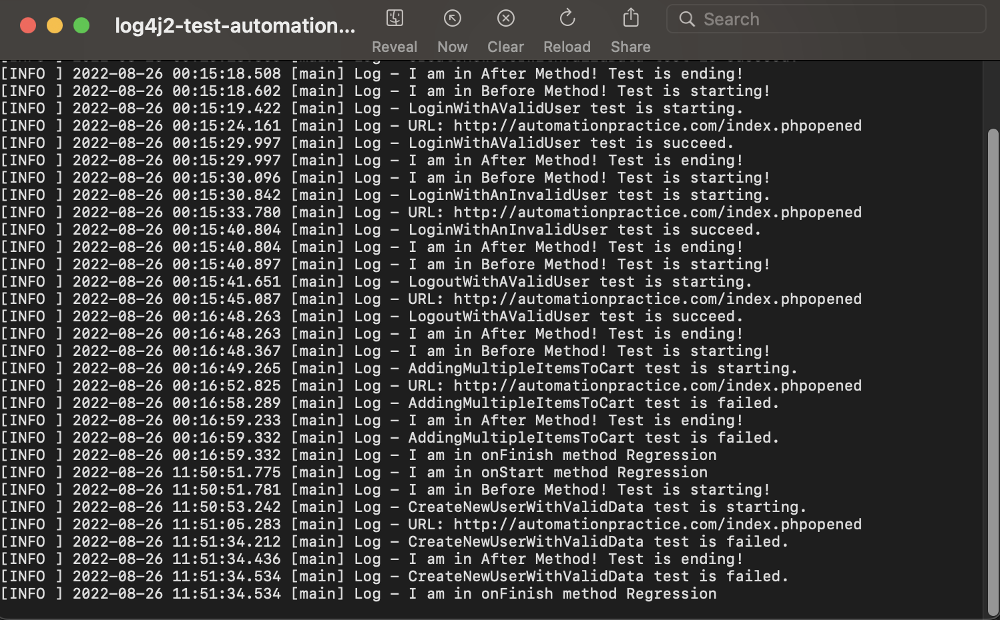

# Automation framework made with Java + Selenium

## The project 💻

A *Java + Selenium* template to create new automation framework projects!

## Tools ⚙️

* *Java v18.0.2.*
* *Selenium v3.141.59.*
* *TestNG v6.8.*
* *log4j v2.14.1.*
* *JavaFaker v1.0.2.*
* *ExtentReports v5.0.9.*
* *OpenCSV v4.6.*
* *WebDriverManager v5.0.3.*
* *Lombok v1.18.24.*

## Project folder structure 🗂️

```bash
.
├── PageObjectModel/
│   ├── Components/
│   │   ├── Home
│   │   └── Results
│   ├── Pages
│   └── Utilities
└── Tests/
    ├── APIAndData/
    │   ├── Client
    │   ├── Data
    │   └── Models
    ├── UI/
    │   └── AutomationResources
    └── Utilities
```

## Setup 🛠️

I developed the code using a Mac, but it should work on a PC.

The following steps can be executed using the terminal and UI of **IntelliJ**.

1. Clone the repo.-

```bash
> https://github.com/ArCiGo/Java-Automation-Framework.git

> git checkout master
```

2. Once you cloned the repo, look for the _pom.xml_ file, at root, right click over the file, select _maven_ option and then click on _Download Sources_ or _Download Sources and Documentation_.

3. Delete the folders, files or branches you don't need.

## Run the tests ⚡️

1. Look for the _testng.xml_ file at **src/ => test/ => resources/**, right click over the file and click on _Run_.

When you execute the tests, new folders are generated at the workspace root (**APIReports** and **UIReports**). Inside of these folders, you are going to see the *index.html* reports (you can open them using your favorite browser). Also, new log files are generated (*APIlogs-^.txt*, *UIlogs-^.txt*) and you can open them using any text editor.




## Collaborations 👨‍🏭

Do you want to collaborate or contribute in this project? No problem! I'm open to improvements, comments and suggestions. Just do a PR with your suggestions and we can discuss them 😀